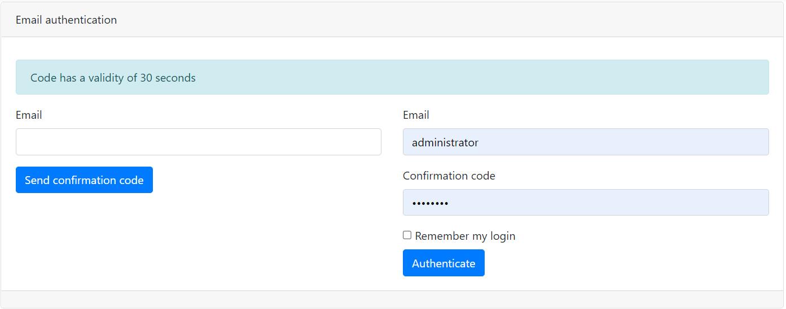

# Authentication Methods

## Authentication Context Class Reference (ACR) 

The Authentication Context Class Reference (ACR) specifies a set of business rules that the authentications are being requested to satisfy. 
These rules can often be satisfied by using a number of different authentication methods, either singly or in combination.

In short, the Authentication Context Class Reference (ACR) ensures the correctness of the user identity. 
In SimpleIdServer, the ACR is similar to the Level Of Assurance. The higher your Level Of Assurance, the better the identity of a user can be trusted.  

It's up to the Relying Party to specify the ACR value. This value is passed in the `acr_values` parameter with the authorization query.

**Example** : If you want to authenticate with a Level Of Assurance equals to 2, navigate to the following URL : [https://localhost:5001/authorization?client_id=umaClient&redirect_uri=https://localhost:60001/signin-oidc&response_type=code&scope=openid%20profile&state=state&acr_values=sid-load-02&prompt=login](https://localhost:5001/authorization?client_id=umaClient&redirect_uri=https://localhost:60001/signin-oidc&response_type=code&scope=openid%20profile&state=state&acr_values=sid-load-02&prompt=login).
During the authentication flow, the user agent will be redirected to the `Password` and `Sms` authentication window.

The list of Authentication Context Class Reference (ACR) can be configured in the `OpenIdDefaultConfiguration.cs` file. 

By default, there are two ACR values : `sid-load-01` and `sid-load-02`.

```
public static List<AuthenticationContextClassReference> AcrLst => new List<AuthenticationContextClassReference>
{
    new AuthenticationContextClassReference
    {
        DisplayName = "First level of assurance",
        Name = "sid-load-01",
        AuthenticationMethodReferences = new List<string>
        {
            "pwd"
        }
    },
    new AuthenticationContextClassReference
    {
        DisplayName = "Second level of assurance",
        Name = "sid-load-02",
        AuthenticationMethodReferences = new List<string>
        {
            "pwd",
            "sms"
        }
    }
};
```

The list of available authentication methods are described in the next chapters.

| Authentication Method | Name                          | 
| --------------------- | ----------------------------- |
| pwd                   | Login Password Authentication |
| email                 | Email Authentication          |
| sms                   | Sms Authentication            |

## Login Password Authentication

**Authentication method** : pwd

The Login/Password authentication is included and configured in all the OPENID templates.
There is no need to do manual changes.

## Email Authentication

**Authentication method** : email

An OPENID server with Login/Password and Email authentications can be installed like this.

```
mkdir QuickStart
cd QuickStart

mkdir src
cd src

dotnet new openidemail -n OpenIdEmail
```

* Open the `OpenIdStartup.cs` and replace the `SMTPUSERNAME`, `SMTPPASSWORD`, `FROMEMAIL`, `SMTPHOST`, `SMTPPORT` with the correct values.

| Property     | Description                                              | Default Value  |
| ------------ | -------------------------------------------------------- | -------------- |
| SmtpUserName | Email is used to authenticate against the SMTP server    |                |
| SmtpPassword | Password is used to authenticate against the SMTP server |                |
| FromEmail    | Sender of the email                                      |                |
| SmtpHost     | SMTP Host                                                | smtp.gmail.com |
| SmtpPort     | SMTP Port                                                | 587            |

* Edit the `OpenIdDefaultConfiguration.cs` file and add an ACR :

```
new AuthenticationContextClassReference
{
    DisplayName = "Second level of assurance",
    Name = "sid-load-02-1",
    AuthenticationMethodReferences = new List<string>
    {
        "pwd",
        "email"
    }
}
```

* Always in the `OpenIdDefaultConfiguration.cs` file, update the EMAIL with yours :

```
new UserClaim(Jwt.Constants.UserClaims.Email, "<<EMAIL>>")
```

* Run the application

```
dotnet run --urls=https://localhost:5001
```

* Navigate to this URL [https://localhost:5001/authorization?client_id=umaClient&redirect_uri=https://localhost:60001/signin-oidc&response_type=code&scope=openid%20profile&state=state&acr_values=sid-load-02-1&prompt=login](https://localhost:5001/authorization?client_id=umaClient&redirect_uri=https://localhost:60001/signin-oidc&response_type=code&scope=openid%20profile&state=state&acr_values=sid-load-02-1&prompt=login)
* Submit the credentials - Login : `sub`, Password : `password`.
* Submit the confirmation code received on your email.



## SMS Authentication

**Authentication method** : sms

SimpleIdServer is using [Twilio](https://www.twilio.com/) to send confirmation code to phones.

An OPENID server with Login/Password and SMS authentications can be installed like this.

```
mkdir QuickStart
cd QuickStart

mkdir src
cd src

dotnet new openidsms -n OpenIdSms
```

* Open the `OpenIdStartup.cs` and replace the `ACCOUNTSID`, `AUTHTOKEN` and `FROMPHONENUMBER` with the correct values, for more information refer to the [official website](https://support.twilio.com/hc/en-us/articles/223136027-Auth-Tokens-and-How-to-Change-Them). 

```
AddSMSAuthentication(opts =>
{
    opts.AccountSid = "<<ACCOUNTSID>>";
    opts.AuthToken = "<<AUTHTOKEN>>";
    opts.FromPhoneNumber = "<<FROMPHONENUMBER>>";
})
```


* Open the `OpenIdDefaultConfiguration.cs` file, and update the PHONENUMBER with yours :

```
new UserClaim(SimpleIdServer.Jwt.Constants.UserClaims.PhoneNumber, "<<PHONENUMBER>>")
```

* Run the application.

```
dotnet run --urls=https://localhost:5001
```

* Navigate to this URL [https://localhost:5001/authorization?client_id=umaClient&redirect_uri=https://localhost:60001/signin-oidc&response_type=code&scope=openid%20profile&state=state&acr_values=sid-load-02&prompt=login](https://localhost:5001/authorization?client_id=umaClient&redirect_uri=https://localhost:60001/signin-oidc&response_type=code&scope=openid%20profile&state=state&acr_values=sid-load-02&prompt=login)
* Submit the credentials - Login : `sub`, Password : `password`.
* Submit the confirmation code received on your phone.


## SMS and Email authentication

**Authentication methods** : sms and email

An OPENID server with all the authentication methods can be installed like this :

```
mkdir QuickStart
cd QuickStart

mkdir src
cd src

dotnet new openidfull -n OpenIdFull
```