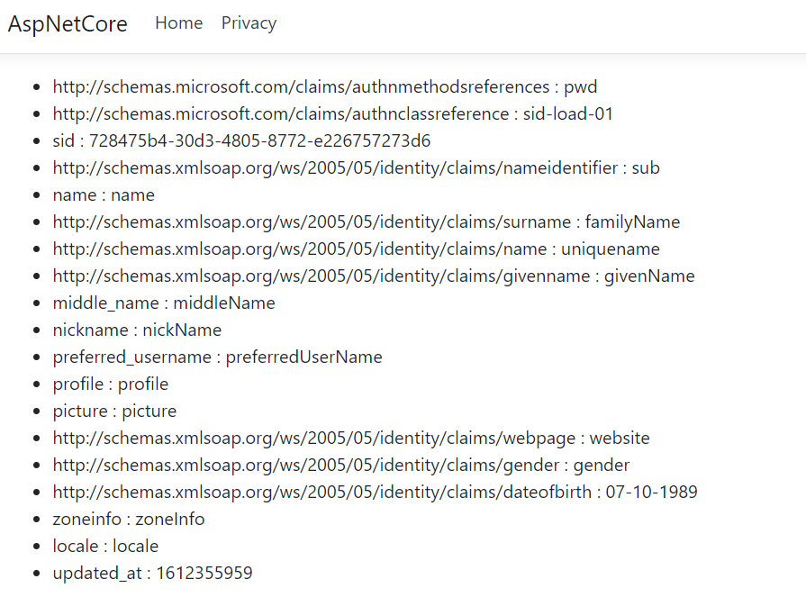
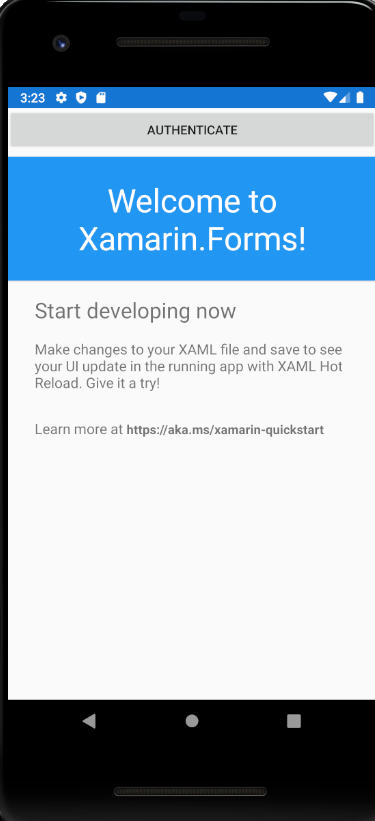
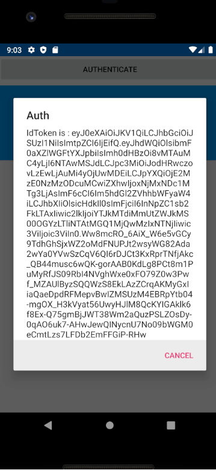

# Protect application from undesirable users

## Recommended flow by application type

There are different grant-types to get tokens, the choice depends on the type of application.


| Applications                                 | Recommended Configuration                                                    |
| -------------------------------------------- | ---------------------------------------------------------------------------- |
| Server-Side (Web application) - ASP.NET CORE | **Grant-Type** : authorization code                                          |
| Single Page Application (SPA) - Angular      | **Grant-Type** : authorization code, **Client Authentication Method** : PKCE |
| Native - Mobile, WPF application             | **Grant-Type** : authorization code, **Client Authentication Method** : PKCE |
| Trusted                                      | **Grant-Type** : password                                                    |

## Server-Side application

**Example** : ASP.NET CORE application.

Server-Side application should use *authorization code* grant-type.

> [!WARNING]
> Before you start, Make sure there is a Visual Studio Solution with a configured OpenId server.
	
### Source Code

The source code of this project can be found [here](https://github.com/simpleidserver/SimpleIdServer/tree/master/samples/ProtectApplicationFromUndesirableUsers/AspNetCore).
 
### Configure OpenId Server

The first step consists to configure the OPENID client.

* Open the Visual Studio Solution and edit the `OpenIdDefaultConfiguration.cs` file.
* Add a new OpenId client :

```
new OpenIdClient
{
    ClientId = "website",
    ClientSecret = "websiteSecret",
    ApplicationKind = ApplicationKinds.Web,
    TokenEndPointAuthMethod = "client_secret_post",
    ApplicationType = "web",
    UpdateDateTime = DateTime.UtcNow,
    CreateDateTime = DateTime.UtcNow,
    TokenExpirationTimeInSeconds = 60 * 30,
    RefreshTokenExpirationTimeInSeconds = 60 * 30,
    TokenSignedResponseAlg = "RS256",
    IdTokenSignedResponseAlg = "RS256",
    AllowedScopes = new List<OAuthScope>
    {
        SIDOpenIdConstants.StandardScopes.OpenIdScope,
        SIDOpenIdConstants.StandardScopes.Profile,
        SIDOpenIdConstants.StandardScopes.Email
    },
    GrantTypes = new List<string>
    {
        "authorization_code",
    },
    RedirectionUrls = new List<string>
    {
        "https://localhost:7000/signin-oidc"
    },
    PreferredTokenProfile = "Bearer",
    ResponseTypes = new List<string>
    {
        "token",
        "id_token"
    }
}
```

* Run the OPENID server.

```
cd src\OpenId
dotnet run
```

### Create ASP.NET CORE application

The last step consists to create and configure an ASP.NET CORE project.

* Open a command and navigate to the `src` subfolder of your project.
* Create a directory `AspNetCore` and create an ASP.NET CORE project in it :

```
mkdir AspNetCore

dotnet new mvc -n AspNetCore
```

* Navigate to the directory `AspNetCore` and install the Nuget package `Microsoft.AspNetCore.Authentication.OpenIdConnect`.

```
dotnet add package Microsoft.AspNetCore.Authentication.OpenIdConnect
```

* Add the `AspNetCore` project into your Visual Studio solution.

```
cd ..\..
dotnet sln add ./src/AspNetCore/AspNetCore.csproj
```

* Edit the `Startup.cs` file and configure the OpenId authentication. In the `ConfigureServices` procedure, add the following code :

```
services.AddAuthentication(options =>
{
    options.DefaultScheme = "Cookies";
    options.DefaultChallengeScheme = "sid";
})
    .AddCookie("Cookies")
    .AddOpenIdConnect("sid", options =>
    {
        options.SignInScheme = "Cookies";

        options.Authority = "http://localhost:5000";
        options.RequireHttpsMetadata = false;

        options.ClientId = "website";
        options.SaveTokens = true;
    });
```

* To ensure the authentication services execute on each request, add `UseAuthentication` in the `Configure` procedure. The procedure should look like to something like this :

```
public void Configure(IApplicationBuilder app, IWebHostEnvironment env)
{
	app.UseHttpsRedirection();
	app.UseStaticFiles();
	
	app.UseRouting();
	
	app.UseAuthentication();
	app.UseAuthorization();
	
	app.UseEndpoints(endpoints =>
	{
		endpoints.MapControllerRoute(
			name: "default",
			pattern: "{controller=Home}/{action=Index}/{id?}");
	});
}
```

* Add a `ClaimsController` with one protected operation :

```
public class ClaimsController : Controller
{
    [Authorize]
    public IActionResult Index()
    {
        return View();
    }
}
```

* Create a new view `Views\Claims\Index.cshtml`. It will display all the claims of the authenticated user.

```
<ul>
    @foreach (var claim in User.Claims)
    {
        <li>@claim.Type : @claim.Value</li>
    }
</ul>
```

* In a command prompt, navigate to the directory `src\AspNetCore` and run the application under the port `7000`.

```
dotnet run --urls=https://localhost:7000
```

* Browse this URL [https://localhost:7000/claims](https://localhost:7000/claims), the User-Agent is automatically redirected to the OPENID server. 
  Submit the credentials - login : `sub`, password : `password` and confirm the consent. You'll be redirected to the following screen where your claims will be displayed.



## Single Page Application (SPA)

**Example**: Angular application.

SPA application use *authorization code* grant-type with *PKCE* client authentication method.

> [!WARNING]
> Before you start, Make sure there is a Visual Studio Solution with a configured OpenId server.
	
### Source Code

The source code of this project can be found [here](https://github.com/simpleidserver/SimpleIdServer/tree/master/samples/ProtectApplicationFromUndesirableUsers/Spa).
 
### Configure OpenId Server

The first step consists to configure the OPENID client.

* Open the Visual Studio solution and edit `OpenIdDefaultConfiguration.cs` file.
* Add a new OpenId client:

```
new OpenIdClient
{
    ClientId = "website",
    ClientSecret = "websiteSecret",
    ApplicationKind = ApplicationKinds.SPA,
    TokenEndPointAuthMethod = "pkce",
    ApplicationType = "web",
    UpdateDateTime = DateTime.UtcNow,
    CreateDateTime = DateTime.UtcNow,
    TokenExpirationTimeInSeconds = 60 * 30,
    RefreshTokenExpirationTimeInSeconds = 60 * 30,
    TokenSignedResponseAlg = "RS256",
    IdTokenSignedResponseAlg = "RS256",
    AllowedScopes = new List<OAuthScope>
    {
        SIDOpenIdConstants.StandardScopes.OpenIdScope,
        SIDOpenIdConstants.StandardScopes.Profile,
        SIDOpenIdConstants.StandardScopes.Email,
        SIDOpenIdConstants.StandardScopes.Role
    },
    GrantTypes = new List<string>
    {
        "authorization_code"
    },
    RedirectionUrls = new List<string>
    {
        "http://localhost:4200"
    },
    PreferredTokenProfile = "Bearer",
    ResponseTypes = new List<string>
    {
        "token",
        "id_token",
        "code"
    }
}
```

* Run the OPENID server.

```
cd src\OpenId
dotnet run
```

### Create angular application

The last step consists to create and configure an Angular project.

* Open a command prompt and navigate to the `src` subfolder of your project.
* Create an ASP.NET CORE with angular project, its name must be `Spa`.

```
mkdir Spa

dotnet new angular -n Spa
```

* Navigate to the directory `Spa\ClientApp` and install the npm package `angular-oauth2-oidc`.

```
cd Spa\ClientApp

npm i angular-oauth2-oidc --save
```

* Add the `Spa` project into your Visual Studio solution.

```
cd ..\..\..
dotnet sln add ./src/Spa/Spa.csproj
```

* Edit the file `ClientApp\src\app\app.module.ts` and import the `OAuthModule` module.

```
@NgModule({
  declarations: [
	// etc.
  ],
  imports: [
	// etc.
    OAuthModule.forRoot()
  ],
  providers: [],
  bootstrap: []
})
export class AppModule { }
```

* Create an `auth-config.ts` file in the directory `ClientApp\src\app`, replace its content with the following code. This file contains the authentication settings : Url of the identity provider or the Client Identifier.

```
import { AuthConfig } from 'angular-oauth2-oidc';

export const authCodeFlowConfig: AuthConfig = {
  issuer: 'http://localhost:5000',
  redirectUri: window.location.origin,
  clientId: 'website',
  responseType: 'code',
  scope: 'openid profile email role',
  showDebugInformation: true,
};
```

* Edit the `ClientApp\src\app\nav-menu\nav-menu.component.ts` file, import the `authCodeFlowConfig` JSON object, inject the `OAuthService` into the constructor and add a `login` procedure. This procedure will be called to initiate the authentication workflow.

```
import { OAuthService } from 'angular-oauth2-oidc';
import { authCodeFlowConfig } from '../auth-config';

@Component({
  selector: 'app-nav-menu',
  templateUrl: './nav-menu.component.html',
  styleUrls: ['./nav-menu.component.css']
})
export class NavMenuComponent {  
  isConnected: boolean = false;
  name: string;

  constructor(private oauthService: OAuthService) {
    this.oauthService.configure(authCodeFlowConfig);
    this.oauthService.loadDiscoveryDocumentAndTryLogin();
    var claims: any = this.oauthService.getIdentityClaims();
    if (!claims) {
      return;
    }

    this.isConnected = true;
    this.name = claims["sub"];
  }

  login(evt: any) {
    evt.preventDefault();
    this.oauthService.initImplicitFlow();
  }
}
```

* Edit the `ClientApp\src\app\nav-menu\nav-menu.component.html` file and add a login button.

```
<li class="nav-item" *ngIf="!isConnected">
  <a class="nav-link text-dark" (click)="login($event)">Authenticate</a>
</li>
<li class="nav-item" *ngIf="isConnected">
  <a class="nav-link text-dark">Welcome {{name}}</a>
</li>
```

* In a command prompt, navigate to the `src\Spa` directory and launch the project.

```
dotnet run --urls=http://localhost:4200
```

* Navigate to the website [http://localhost:4200](http://localhost:4200) and authenticate with the login : `sub` and password : `password`.


## Native application

**Examples** : WPF, Xamarin application etc...

Native application use *authorization code* grant-type with *PKCE* client authentication method.

> [!WARNING]
> Before you start, Make sure there is a Visual Studio Solution with a configured OpenId server.
	
### Source Code

The source code of this project can be found [here](https://github.com/simpleidserver/SimpleIdServer/tree/master/samples/ProtectApplicationFromUndesirableUsers/Native).
 
### Configure OpenId Server

The first step consists to configure the OPENID client.

* Open the Visual Studio Solution and edit the `OpenIdDefaultConfiguration.cs` file.
* Add a new OpenId client :

```
new OpenIdClient
{
    ClientId = "nativeXamarin",
    ClientSecret = "nativeXamarinSecret",
    ApplicationKind = ApplicationKinds.Native,
    TokenEndPointAuthMethod = "pkce",
    ApplicationType = "web",
    UpdateDateTime = DateTime.UtcNow,
    CreateDateTime = DateTime.UtcNow,
    TokenExpirationTimeInSeconds = 60 * 30,
    RefreshTokenExpirationTimeInSeconds = 60 * 30,
    TokenSignedResponseAlg = "RS256",
    IdTokenSignedResponseAlg = "RS256",
    AllowedScopes = new List<OAuthScope>
    {
        SIDOpenIdConstants.StandardScopes.OpenIdScope,
        SIDOpenIdConstants.StandardScopes.Profile,
        SIDOpenIdConstants.StandardScopes.Email
    },
    GrantTypes = new List<string>
    {
        "authorization_code"
    },
    RedirectionUrls = new List<string>
    {
        "com.companyname.native:/oauth2redirect"
    },
    PreferredTokenProfile = "Bearer",
    ResponseTypes = new List<string>
    {
        "code"
    }
}
```

* Run the OPENID server.

```
cd src\OpenId
dotnet run --urls=http://*:5000;https://*:5001
```

### Create a Xamarin application

The last step consists to create and configure a xamarin project.

* Open the `QuickStart` Visual Studio Solution.
* Create an empty Mobile Application (Xamarin Forms) project. Its name must be `Native`.
* In the `Native` project, add a new `AuthInfo` class. This class will be used by the `ILoginProvider` interface to return the authentication result.

```
public class AuthInfo
{
    public bool IsAuthorized { get; set; }
    public string AccessToken { get; set; }
    public string RefreshToken { get; set; }
    public string Scope { get; set; }
    public string IdToken { get; set; }
}
```
 
* In the `Native` project, add a new `ILoginProvider` interface with one function `LoginAsync`.

```
public interface ILoginProvider
{
    Task<AuthInfo> LoginAsync();
}
```

* Add the nuget package `Xamarin.Android.Support.v4` into the `Native.Android` project.
* Add the nuget package `Xamarin.Android.Support.CustomTabs` into the `Native.Android` project.
* Edit the `Nuget.Android` project and add the following line inside the `PropertyGroup` element.

```
<AndroidManifestPlaceholders>appAuthRedirectScheme=''</AndroidManifestPlaceholders>
```

* Edit the Android Manifest, set the package name to `com.companyname.nativexamarin` and add the activity below inside the `application` element.

```
<activity android:name="net.openid.appauth.RedirectUriReceiverActivity">
  <intent-filter>
    <action android:name="android.intent.action.VIEW" />
    <category android:name="android.intent.category.DEFAULT" />
    <category android:name="android.intent.category.BROWSABLE" />
    <data android:scheme="com.companyname.nativexamarin"/>
  </intent-filter>
</activity>
```

* Add the nuget package `Xamarin.OpenId.AppAuth.Android` into the `Native.Android` project. This Nuget package is a client SDK for communicating with OAUTH2.0 and OPENID connect providers. 
* Add the nuget package `Newtonsoft.Json` into the `Native.Android` project.
* Add the nuget package `Nito.AsyncEx` into the `Native.Android` project. This Nuget package is a helper library for the Task-Based Asynchronous Pattern (TAP).
* In the `Native.Android` project, add a reference to `System.Net.Http`.
* In the `Native.Android` project, edit the `MainActivity` class and add a singleton: 

```
public class MainActivity : global::Xamarin.Forms.Platform.Android.FormsAppCompatActivity
{
	internal static MainActivity Instance { get; private set; }
	
	protected override void OnCreate(Bundle savedInstanceState)
    {
		Instance = this;
	}
}
```

* In the `Native.Android` project, add a new `AndroidLoginProvider` class. Its content must look like :

```
public class AndroidLoginProvider : ILoginProvider
{
    private readonly AuthorizationService _authService;
    private static AndroidLoginProvider _instance;
    private static AuthState _authState;
    private static AsyncAutoResetEvent _loginResultWaitHandle;

    public AndroidLoginProvider()
    {
        if (_instance == null)
        {
            _instance = this;
        }

        _authService = new AuthorizationService(MainActivity.Instance);
    }

    internal static AndroidLoginProvider Instance
    {
        get
        {
            return _instance;
        }
    }

    public async Task<AuthInfo> LoginAsync()
    {
        _loginResultWaitHandle = new AsyncAutoResetEvent(false);
        try
        {
            using (var httpClient = new HttpClient(GetUnsecuredHandler()))
            {
                var httpResult = await httpClient.GetAsync("https://10.0.2.2:5001/.well-known/openid-configuration");
                var json = await httpResult.Content.ReadAsStringAsync();
                var jObj = JObject.Parse(json);
                var configuration = new AuthorizationServiceConfiguration(
                    Android.Net.Uri.Parse(jObj["authorization_endpoint"].ToString()),
                    Android.Net.Uri.Parse(jObj["token_endpoint"].ToString()))
                {
                    DiscoveryDoc = new AuthorizationServiceDiscovery(new JSONObject(json))
                };
                MakeAuthRequest(configuration, new AuthState());
                await _loginResultWaitHandle.WaitAsync();
            }
        }
        catch (AuthorizationException) { }


        return new AuthInfo()
        {
            IsAuthorized = _authState?.IsAuthorized ?? false,
            AccessToken = _authState?.AccessToken,
            IdToken = _authState?.IdToken,
            RefreshToken = _authState?.RefreshToken,
            Scope = _authState?.Scope
        };
    }

    private void MakeAuthRequest(AuthorizationServiceConfiguration serviceConfig, AuthState authState)
    {
        var authRequest = new AuthorizationRequest.Builder(
                serviceConfig, "nativeXamarin",
                $"{ResponseTypeValues.Code}",
                Android.Net.Uri.Parse("com.companyname.nativexamarin:/oauth2redirect"))
            .SetScope("openid profile email")
            .Build();
        var postAuthorizationIntent = CreatePostAuthorizationIntent(MainActivity.Instance, authRequest, serviceConfig.DiscoveryDoc, authState);
        _authService.PerformAuthorizationRequest(authRequest, postAuthorizationIntent);
    }

    private PendingIntent CreatePostAuthorizationIntent(Context context, AuthorizationRequest request, AuthorizationServiceDiscovery discoveryDoc, AuthState authState)
    {
        var intent = new Intent(context, typeof(MainActivity));
        intent.PutExtra("authState", authState.JsonSerializeString());

        if (discoveryDoc != null)
        {
            intent.PutExtra(
                "authServiceDiscovery",
                discoveryDoc.DocJson.ToString());
        }

        return PendingIntent.GetActivity(context, request.GetHashCode(), intent, 0);
    }

    internal void NotifyOfCallback(Intent intent)
    {
        try
        {
            if (!intent.HasExtra("authState"))
            {
                _authState = null;
            }
            else
            {
                try
                {
                    _authState = AuthState.JsonDeserialize(intent.GetStringExtra("authState"));
                }
                catch (JSONException)
                {
                    _authState = null;
                }
            }
            if (_authState != null)
            {
                AuthorizationResponse response = AuthorizationResponse.FromIntent(intent);
                AuthorizationException authEx = AuthorizationException.FromIntent(intent);
                _authState.Update(response, authEx);
                if (response != null)
                {
                    try
                    {
                        var clientAuthentication = _authState.ClientAuthentication;
                    }
                    catch (ClientAuthenticationUnsupportedAuthenticationMethod)
                    {
                        SetWaitHandle();
                        return;
                    }

                    var request = response.CreateTokenExchangeRequest();
                    using (var httpClient = new HttpClient(GetUnsecuredHandler()))
                    {
                        var jObj = new List<KeyValuePair<string, string>>
                        {
                            new KeyValuePair<string, string>("client_id", request.ClientId),
                            new KeyValuePair<string, string>("code", request.AuthorizationCode),
                            new KeyValuePair<string, string>("code_verifier", request.CodeVerifier),
                            new KeyValuePair<string, string>("grant_type", request.GrantType),
                            new KeyValuePair<string, string>("scope", request.Scope),
                            new KeyValuePair<string, string>("redirect_uri", request.RedirectUri.ToString())
                        };
                        var httpRequest = new HttpRequestMessage
                        {
                            Method = HttpMethod.Post,
                            RequestUri = new Uri(request.Configuration.TokenEndpoint.ToString()),
                            Content = new FormUrlEncodedContent(jObj)
                        };
                        var httpResult = httpClient.SendAsync(httpRequest).Result;
                        var tokenResponseJObject = JObject.Parse(httpResult.Content.ReadAsStringAsync().Result);
                        tokenResponseJObject.Add("request", JObject.Parse(request.JsonSerializeString()));
                        var tokenResponse = TokenResponse.JsonDeserialize(new JSONObject(tokenResponseJObject.ToString()));
                        ReceivedTokenResponse(tokenResponse, null);
                    }
                }
            }
            else
            {
                SetWaitHandle();
            }
        }
        catch (Exception)
        {
            SetWaitHandle();
        }
    }

    private void ReceivedTokenResponse(TokenResponse tokenResponse, AuthorizationException authException)
    {
        try
        {
            _authState.Update(tokenResponse, authException);
        }
        catch (Exception) { }
        finally
        {
            SetWaitHandle();
        }
    }

    private HttpClientHandler GetUnsecuredHandler()
    {
        HttpClientHandler handler = new HttpClientHandler();
        handler.ServerCertificateCustomValidationCallback = (message, cert, chain, errors) =>
        {
            return true;
        };

        return handler;
    }

    private void SetWaitHandle()
    {
        if (_loginResultWaitHandle != null)
        {
            _loginResultWaitHandle.Set();
        }
    }
}
```

* In the `Native.Android` project, edit the `MainActivity` class, register the `AndroidLoginProvider` dependency and process the parameters received by the Intent `com.companyname.native:/oauth2redirect`.

```
protected override void OnCreate(Bundle savedInstanceState)
{
	DependencyService.Register<ILoginProvider, AndroidLoginProvider>();
	if (Intent != null && AndroidLoginProvider.Instance != null)
    {
        AndroidLoginProvider.Instance.NotifyOfCallback(Intent);
    }
}
```

* In the `Native` project, edit the `MainPage.xaml` file and add an Authentication button.

```
<Button Text="Authenticate" Clicked="Authenticate"></Button>
```

* In the `Native` project, edit the `MainPage.xaml.cs` code-behind and add a private `Authenticate` procedure. This procedure will be used to authenticate the end-user.

```
public partial class MainPage : ContentPage
{
	private readonly ILoginProvider _loginProvider;
	
	public MainPage()
	{
		InitializeComponent();
		_loginProvider = DependencyService.Resolve<ILoginProvider>();
	}
	
	private void Authenticate(object sender, EventArgs e)
	{
		_loginProvider.LoginAsync().ContinueWith(async(authInfo) =>
		{
			if (!string.IsNullOrWhiteSpace(authInfo.Result.IdToken))
			{
				MainThread.BeginInvokeOnMainThread(() =>
				{
					App.Current.MainPage.DisplayAlert("Auth", $"IdToken is : {authInfo.Result.IdToken}", "Cancel");
				});
			}
		});
	}
}
```

* Run the android application into an emulator and click on the Authenticate button. You'll be redirected to the Authentication window. Submit the credentials : login - `sub`, password - `password` and confirm the consent.



* The identity token will be displayed in a dialog.



## Trust application

**Example** : Console application.

Server-Side application should use *password* grant-type.

If you own both the client application and the resource that is accessing, then your application can be trusted.

> [!WARNING]
> Before you start, Make sure there is a Visual Studio Solution with a configured OpenId server.

### Source Code

The source code of this project can be found [here](https://github.com/simpleidserver/SimpleIdServer/tree/master/samples/ProtectApplicationFromUndesirableUsers/Trust).
 
### Configure OpenId Server

The first step consists to configure the OPENID client.

* Open the Visual Studio Solution and edit the `OpenIdDefaultConfiguration.cs` file.
* Add a new OpenId client :

```
new OpenIdClient
{
    ClientId = "trusted",
    ClientSecret = "trustedSecret",
    ApplicationKind = ApplicationKinds.Service,
    TokenEndPointAuthMethod = "client_secret_post",
    UpdateDateTime = DateTime.UtcNow,
    CreateDateTime = DateTime.UtcNow,
    TokenExpirationTimeInSeconds = 60 * 30,
    RefreshTokenExpirationTimeInSeconds = 60 * 30,
    TokenSignedResponseAlg = "RS256",
    AllowedScopes = new List<OAuthScope>
    {
        SIDOpenIdConstants.StandardScopes.OpenIdScope,
        SIDOpenIdConstants.StandardScopes.Profile,
        SIDOpenIdConstants.StandardScopes.Email
    },
    GrantTypes = new List<string>
    {
        "password"
    },
    PreferredTokenProfile = "Bearer"
}
```

* Run the OPENID server.

```
cd src\OpenId
dotnet run
```

### Create console application

The last step consists to create and configure a console application.

* Open a command prompt and navigate to the `src` subfolder of your project.
* Create a console application, its name must be `Console`.

```
mkdir Console

dotnet new console -n Console
```

* Add the `Console` project into your Visual Studio solution.

```
cd ..\..

dotnet sln add ./src/Console/Console.csproj
```

* Edit the `Program.cs` file and replace its content with the following code. The grant type `password` is used to authenticate the user and get his access token.

```
class Program
{
    static void Main(string[] args)
    {
        using (var httpClient = new HttpClient())
        {
            var form = new Dictionary<string, string>
            {
                { "grant_type", "password" },
                { "username", "sub" },
                { "password", "password" },
                { "client_id", "trusted" },
                { "client_secret", "trustedSecret" }
            };
            var tokenResponse = httpClient.PostAsync("http://localhost:5000/token", new FormUrlEncodedContent(form)).Result;
            var json = tokenResponse.Content.ReadAsStringAsync().Result;
            System.Console.WriteLine(json);
        }
    }
}
```

* Run the console application, the access token should be displayed.

